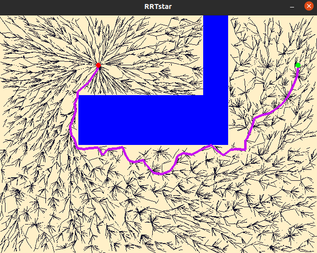

# RRT* Route Planning

This repository contains a project done to gain understanding of the [Rapidly-exploring Randon Tree (RRT*)](https://en.wikipedia.org/wiki/Rapidly-exploring_random_tree) route planning algorithm.

In this project, the user needs to define the start (x,y) coordinates and the goal (x,y) coordinates, along with a few algorithm parameters and the algorithm can search for an optimum path in the defined search space. The visualization is implemented using [Pygame](https://www.pygame.org/wiki/about) module.

The challenge for the search algorithm is to find an optimum path between the start node and the goal node avoiding a static obstacle created in the search space.

